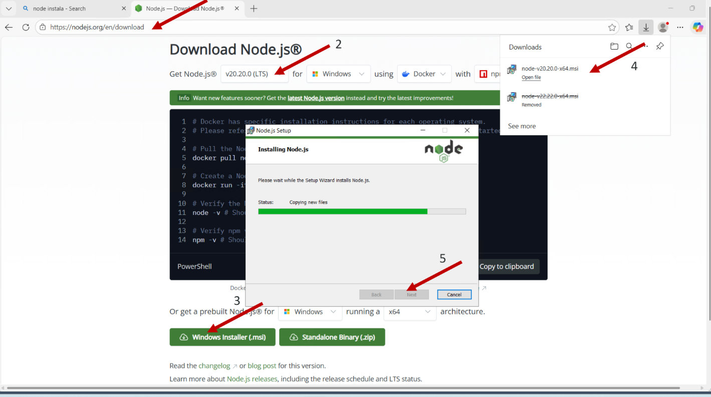

# Orientações para prática de n8n

Para a prática de n8n você precisa ter o Node.js versão 20.20.0 instalado na sua máquina, para fazer o download basta acessar (https://nodejs.org/pt-br/download), escolher a versão e instalar. 



Verifique via cmd ou power shell se a versão está correta utilizando o comando `node --version`, se estiver correto deve parecer `v20.20.0`. 

Depois rode:
- `npm install -g n8n` para instalar
- `n8n start` para rodar

O terminal deve se manter aberto durante toda a prática, ele que está executando a interface do n8n. 

**Complementar:** Caso você queira fazer isso em um servidor, nesse link (https://github.com/MachadoAmanda/example-codes-oci/blob/main/Guia%20de%20como%20instalar%20n8n%20(Windows%20e%20Ubuntu)%20e%20habilitar%20OCI%20no%20seu%20workflow.pdf) tem um guia de como subir um servidor linux ou windows na OCI para rodar o n8n e manter seus agentes ativos. Esse não é um passo obrigatíorio e você pode fazer em servidor próprio ou usando qualquer outro cloud provider da sua preferência. 


-------------------------------------------------------------

# Guia LangChain & LangGraph 

Este repositório utiliza:

-   **LangChain 1.1.0**
-   **LangGraph 0.2.x**

Este documento é um guia técnico dos principais elementos dessas
bibliotecas para apoiar as aulas.


# LangChain 1.1.0

LangChain é uma camada de orquestração sobre modelos de linguagem. Ele
organiza chamadas ao modelo, tool calling e agentes.


## Declaração da LLM

``` python
from langchain.chat_models import ChatOpenAI

llm = ChatOpenAI(
    model="xai.grok-4-fast-non-reasoning",
    temperature=0.2,
    max_tokens=500,
    streaming=False
)
```

### Parâmetros principais

-   **model** → Nome do modelo usado.
-   **temperature** → Grau de aleatoriedade (0 = determinístico).
-   **max_tokens** → Limite de tokens de saída.
-   **streaming** → Se a resposta será enviada em partes.

### O que acontece no background?

-   LangChain cria um wrapper do modelo.
-   Quando você chama `.invoke()`, ele formata a mensagem.
-   Envia e retorna no formato padronizado de mensagem.


## Criando Tools

Tools são funções Python que o modelo pode chamar.

``` python
from langchain.tools import tool

@tool
def soma(a: int, b: int) -> int:
    """Soma dois números"""
    return a + b
```

### O que acontece no background?

-   O decorator `@tool` transforma a função em um schema.
-   Esse schema é enviado ao modelo.
-   LangChain executa a função real.
-   O resultado retorna ao modelo.


## Criando um Agent com create_agent

``` python
from langchain.agents import create_agent

agent = create_agent(
    model=llm,
    tools=[soma]
)
```

## Execução

``` python
response = agent.invoke({
    "messages": [
        {"role": "user", "content": "Quanto é 2 + 3?"}
    ]
})

print(response)
```

### O que acontece internamente?

1.  O usuário envia mensagem.
2.  O modelo recebe a mensagem + descrição das tools + system prompt
3.  O modelo decide:
    -   Responder direto
    -   Ou chamar uma tool
4.  Se chamar tool:
    -   LangChain executa a função Python
    -   O resultado volta para o modelo
5.  O modelo analisa e decide se executa uma tool novamente ou se gera a resposta final

Esse processo segue o padrão ReAct internamente.


# LangGraph 0.2.x

LangGraph é usado quando precisamos de:

-   Estado explícito
-   Controle de fluxo
-   Planejamento estruturado

Ele funciona como um grafo de estados.


## Definindo o estado

``` python
from typing import TypedDict

class AgentState(TypedDict):
    task: str
    result: str
    attempts: int
```

O estado é um dicionário tipado. Ele representa os dados que circulam no
grafo.


## Criando os nós

Nós são funções que recebem e executam mudanças no estado.

``` python
def generate(state: AgentState):
    return {
        "result": f"Executando tarefa: {state['task']}"
    }
```

Cada nó:

-   Recebe o estado atual
-   Retorna um dicionário com alterações


## Construindo o Grafo

``` python
from langgraph.graph import StateGraph, END

graph = StateGraph(AgentState)

graph.add_node("generate", generate)

graph.set_entry_point("generate")

graph.add_edge("generate", END)

app = graph.compile()
```

### O que acontece no background?

-   `StateGraph` cria a estrutura.
-   `add_node` registra funções.
-   `add_edge` define transições.
-   `compile()` transforma o grafo em executável.


## Executando o Grafo

``` python
result = app.invoke({
    "task": "Explique ReAct",
    "result": "",
    "attempts": 0
})

print(result)
```

O motor do LangGraph:

1.  Inicia no entry point.
2.  Executa o node.
3.  Atualiza o estado.
4.  Segue para o próximo node.
5.  Até encontrar o `END`.


## Exemplo de condição

`add_conditional_edges` cria uma condição para um nó, sempre que o nó for executado, sua sequência é definida por essa condição.

``` python
def check_attempts(state: AgentState):
    if state["attempts"] > 2:
        return END
    return "generate"

graph.add_conditional_edges(
    "generate",
    check_attempts,
    {
        "generate": "generate",
        END: END
    }
)
```

# Versões Utilizadas


-   LangChain 1.1.x
-   LangGraph 0.2.x

Importante se atentar a esse detalhe, por serem frameworks open-source é comum que a biblioteca esteja em constante atualização. Para evitar quebra de compatibilidade, fixe em uma versão e se mantenha nela. Para fazer isso, basta na hora da instalação da biblioteca usar `langchain==<versão>`, por exemplo `langchain==1.1.0`, versão que usamos nesse repositório.